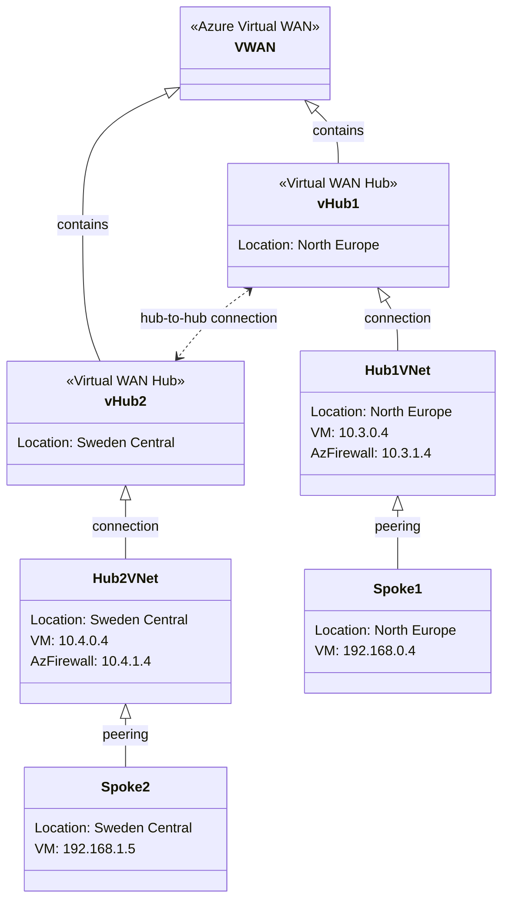

# Express Route Failover

- https://www.georgeollis.com/nva-vwan-routing/

## Test connectivity between spoke1

~~~powershell
# Extract the value of 'prefix' from terraform.tfvars.json into a PowerShell variable

# switch to subscription which contains spoke1 resources
$prefix = (Get-Content -Raw -Path "terraform.tfvars.json" | ConvertFrom-Json).prefix
$subid_spoke1 = (Get-Content -Raw -Path "terraform.tfvars.json" | ConvertFrom-Json).subscription_id_map.spoke1
az account set --subscription $subid_spoke1
az vm run-command invoke -g "${prefix}s1" -n "spoke1" --command-id RunShellScript --scripts "ping -c 4 192.168.1.4" --query "value[].message" -o tsv
~~~

~~~bash
Enable succeeded:
[stdout]
PING 192.168.1.4 (192.168.1.4) 56(84) bytes of data.
64 bytes from 192.168.1.4: icmp_seq=1 ttl=60 time=34.9 ms
64 bytes from 192.168.1.4: icmp_seq=2 ttl=60 time=33.1 ms
64 bytes from 192.168.1.4: icmp_seq=3 ttl=60 time=33.5 ms
64 bytes from 192.168.1.4: icmp_seq=4 ttl=60 time=39.1 ms

--- 192.168.1.4 ping statistics ---
4 packets transmitted, 4 received, 0% packet loss, time 3003ms
rtt min/avg/max/mdev = 33.097/35.158/39.118/2.387 ms

[stderr]
~~~

## Test connectivity between spoke2

~~~powershell
# switch to subscription which contains spoke1 resources
$prefix = (Get-Content -Raw -Path "terraform.tfvars.json" | ConvertFrom-Json).prefix
$subid_spoke2 = (Get-Content -Raw -Path "terraform.tfvars.json" | ConvertFrom-Json).subscription_id_map.spoke2
az account set --subscription $subid_spoke2
az vm run-command invoke -g "${prefix}s2" -n "spoke2" --command-id RunShellScript --scripts "ping -c 4 192.168.0.4" --query "value[].message" -o tsv
~~~

~~~bash
Enable succeeded:
[stdout]
PING 192.168.0.4 (192.168.0.4) 56(84) bytes of data.
64 bytes from 192.168.0.4: icmp_seq=1 ttl=60 time=36.0 ms
64 bytes from 192.168.0.4: icmp_seq=2 ttl=60 time=34.0 ms
64 bytes from 192.168.0.4: icmp_seq=3 ttl=60 time=35.4 ms
64 bytes from 192.168.0.4: icmp_seq=4 ttl=60 time=33.5 ms

--- 192.168.0.4 ping statistics ---
4 packets transmitted, 4 received, 0% packet loss, time 3004ms
rtt min/avg/max/mdev = 33.510/34.745/36.029/1.015 ms

[stderr]
~~~

## Trace the network path

### Spoke1 - Show effective routes with Azure CLI

~~~powershell
az network nic show-effective-route-table -g "${prefix}s1" -n "spoke1"--output table
~~~

| Source  | State  | Address Prefix   | Next Hop Type      | Next Hop IP |
|---------|--------|------------------|--------------------|-------------|
| Default | Active | 192.168.0.0/24   | VnetLocal          |             |
| Default | Active | 10.3.0.0/16      | VNetPeering        |             |
| Default | Active | 0.0.0.0/0        | Internet           |             |
| User    | Active | 192.168.1.0/25   | VirtualAppliance   | 10.3.1.4    |

10.3.0.0/16 traffic is routed to Hub1.
0.0.0.0/0 (default route) sends all other traffic to the internet.
192.168.1.0/25 (user-defined) is routed to a AzFW in Hub1 at 10.3.1.4.

### Hub1 - Show Firewall logs with Azure CLI

Get the corresponding logs from the Application Gateway.

~~~powershell
# Switch to the subscription which contains the log analytics workspace
$subid_plattform = (Get-Content -Raw -Path "terraform.tfvars.json" | ConvertFrom-Json).subscription_id_map.plattform
az account set --subscription $subid_plattform
$lawCustomerId=az monitor log-analytics workspace show -g "${prefix}vwan" -n $prefix --query customerId -o tsv

# Query which will find all Azure Firewall logs related to spoke1 to spoke2 traffic
$queryFWDetails = "AzureDiagnostics | where TimeGenerated > ago(1h) | where Category == 'AzureFirewallNetworkRule'| where msg_s contains 'from 192.168.0.4:0 to 192.168.1.4:0' | project msg_s, TimeGenerated | sort by TimeGenerated desc | take 3"
az monitor log-analytics query -w $lawCustomerId --analytics-query $queryFWDetails -o table
~~~

| TableName     | TimeGenerated                | Msg_s                                                                                                                                           |
|---------------|-----------------------------|--------------------------------------------------------------------------------------------------------------------------------------------------|
| PrimaryResult | 2025-05-21T20:16:22.187778Z | ICMP Type=8 request from 192.168.0.4:0 to 192.168.1.4:0. Action: Allow.. Policy: hub2. Rule Collection Group: hub2. Rule Collection: hub2. Rule: hub2-allow-private-all |
| PrimaryResult | 2025-05-21T20:16:22.152858Z | ICMP Type=8 request from 192.168.0.4:0 to 192.168.1.4:0. Action: Allow.. Policy: hub1. Rule Collection Group: hub1. Rule Collection: hub1. Rule: hub1-allow-private-all |
| PrimaryResult | 2025-05-21T20:14:29.448298Z | ICMP Type=8 request from 192.168.0.4:0 to 192.168.1.4:0. Action: Allow.. Policy: hub2. Rule Collection Group: hub2. Rule Collection: hub2. Rule: hub2-allow-private-all |

~~~powershell
# Query which will find all Azure Firewall logs related to spoke1 to spoke2 traffic and if the traffic has been allowed or denied
$queryFWActions = "AzureDiagnostics | where TimeGenerated > ago(1h) | where SourceIP == '192.168.0.4'| where DestinationIp_s == '192.168.1.4'| summarize Count = count() by Action_s| project Action_s, Count"
az monitor log-analytics query -w $lawCustomerId --analytics-query $queryFWActions -o table
~~~

| Action_s | Count | TableName      |
|----------|-------|---------------|
| Allow    | 6     | PrimaryResult |

### Hub1 - Show effective routes with Azure CLI

~~~powershell
$subid_hub1 = (Get-Content -Raw -Path "terraform.tfvars.json" | ConvertFrom-Json).subscription_id_map.hub1
az account set --subscription $subid_hub1
az network nic show-effective-route-table -g "${prefix}h1" -n "hub1"--output table
~~~

| Source                | State  | Address Prefix   | Next Hop Type         | Next Hop IP      |
|-----------------------|--------|------------------|-----------------------|------------------|
| Default               | Active | 10.3.0.0/16      | VnetLocal             |                  |
| Default               | Active | 192.168.0.0/24   | VNetPeering           |                  |
| Default               | Active | 10.1.0.0/16      | VNetPeering           |                  |
| VirtualNetworkGateway | Active | 192.168.1.0/25   | VirtualNetworkGateway | 10.1.32.4        |
| VirtualNetworkGateway | Active | 10.2.0.0/16      | VirtualNetworkGateway | 10.2.146.169     |
| VirtualNetworkGateway | Active | 10.4.0.0/16      | VirtualNetworkGateway | 10.1.32.4        |
| Default               | Active | 0.0.0.0/0        | Internet              |                  |

Traffic for Spoke2 (192.168.1.4) is going to be send to the vHub1 (virtual WAN Hub) via VirtualNetworkGateway  10.1.32.4

### vHub1 - Show effective routes with Azure CLI

~~~powershell
# Switch to the subscription which contains the virtual hub if not already done
$subid_plattform = (Get-Content -Raw -Path "terraform.tfvars.json" | ConvertFrom-Json).subscription_id_map.plattform
az account set --subscription $subid_plattform
# az network vhub route-table list -g "${prefix}vh1" --vhub-name "vhub1"
$vhub1RTDefaultId= az network vhub route-table show -g "${prefix}vh1" --vhub-name "vhub1" -n "defaultRouteTable" --query id -o tsv
# Get effective routes and remove subscription IDs from the output
$vhub1Routes = az network vhub get-effective-routes -g "${prefix}vh1" -n "vhub1" --resource-type RouteTable --resource-id $vhub1RTDefaultId -o json | ConvertFrom-Json

# Remove subscription IDs from NextHop and RouteOrigin fields
$vhub1Routes.value | ForEach-Object {
    $_.nextHops = ($_.nextHops -replace '^(/[^/]+){5}', '')
    $_.routeOrigin = ($_.routeOrigin -replace '^(/[^/]+){5}', '')
    $_
} | ConvertTo-Json | ConvertFrom-Json
~~~

~~~text
addressPrefixes : {10.2.0.0/16}
asPath          : 12076-133937-12076
nextHopType     : ExpressRouteGateway
nextHops        : {/Microsoft.Network/expressRouteGateways/vhub1}
routeOrigin     : /Microsoft.Network/expressRouteGateways/vhub1

addressPrefixes : {192.168.0.0/25}
nextHopType     : Virtual Network Connection
nextHops        : {}
routeOrigin     :

addressPrefixes : {10.3.0.0/16}
nextHopType     : Virtual Network Connection
nextHops        : {}
routeOrigin     :

addressPrefixes : {192.168.1.0/25}
asPath          : 65520-65520
nextHopType     : Remote Hub
nextHops        : {/Microsoft.Network/virtualHubs/vhub2}
routeOrigin     : /Microsoft.Network/virtualHubs/vhub2

addressPrefixes : {10.4.0.0/16}
asPath          : 65520-65520
nextHopType     : Remote Hub
nextHops        : {/Microsoft.Network/virtualHubs/vhub2}
routeOrigin     : /Microsoft.Network/virtualHubs/vhub2
~~~

Destination IP 192.168.1.4 is routed to remote Hub "vHub2" via vHub1.

### vHub2 - Show effective routes with Azure CLI

~~~powershell
# Switch to the subscription which contains the virtual hub if not already done
$subid_plattform = (Get-Content -Raw -Path "terraform.tfvars.json" | ConvertFrom-Json).subscription_id_map.plattform
az account set --subscription $subid_plattform
$vhub2RTDefaultId= az network vhub route-table show -g "${prefix}vh2" --vhub-name "vhub2" -n "defaultRouteTable" --query id -o tsv
# Get effective routes and remove subscription IDs from the output
$vhub2Routes = az network vhub get-effective-routes -g "${prefix}vh2" -n "vhub2" --resource-type RouteTable --resource-id $vhub2RTDefaultId -o json | ConvertFrom-Json

# Remove subscription IDs from NextHop and RouteOrigin fields
$vhub2Routes.value | ForEach-Object {
    $_.nextHops = ($_.nextHops -replace '^(/[^/]+){5}', '')
    $_.routeOrigin = ($_.routeOrigin -replace '^(/[^/]+){5}', '')
    $_
} | ConvertTo-Json | ConvertFrom-Json
~~~

~~~text
addressPrefixes : {10.1.0.0/16}
asPath          : 12076-133937-12076
nextHopType     : ExpressRouteGateway
nextHops        : {/Microsoft.Network/expressRouteGateways/vhub2}
routeOrigin     : /Microsoft.Network/expressRouteGateways/vhub2

addressPrefixes : {192.168.0.0/25}
asPath          : 65520-65520
nextHopType     : Remote Hub
nextHops        : {/Microsoft.Network/virtualHubs/vhub1}
routeOrigin     : /Microsoft.Network/virtualHubs/vhub1

addressPrefixes : {10.3.0.0/16}
asPath          : 65520-65520
nextHopType     : Remote Hub
nextHops        : {/Microsoft.Network/virtualHubs/vhub1}
routeOrigin     : /Microsoft.Network/virtualHubs/vhub1

addressPrefixes : {10.4.0.0/16}
nextHopType     : Virtual Network Connection
nextHops        : {/Microsoft.Network/virtualHubs/vhub2/hubVirtualNetworkConnections/vhub2-connection}
routeOrigin     : /Microsoft.Network/virtualHubs/vhub2/hubVirtualNetworkConnections/vhub2-connection

addressPrefixes : {192.168.1.0/25}
nextHopType     : Virtual Network Connection
nextHops        : {/Microsoft.Network/virtualHubs/vhub2/hubVirtualNetworkConnections/vhub2-connection}
routeOrigin     : /Microsoft.Network/virtualHubs/vhub2/hubVirtualNetworkConnections/vhub2-connection
~~~

Destination IP 192.168.1.4 is routed to Virtual Network Connection "vhub2-connection".

~~~powershell
az network vhub connection show -g "${prefix}vh2" --vhub-name "vhub2" -n "vhub2-connection" --query routingConfiguration.vnetRoutes
~~~

~~~json
{
  "staticRoutes": [
    {
      "addressPrefixes": [
        "192.168.1.0/25"
      ],
      "name": "vhub2-to-spoke2",
      "nextHopIpAddress": "10.4.1.4"
    }
  ],
  "staticRoutesConfig": {
    "propagateStaticRoutes": true,
    "vnetLocalRouteOverrideCriteria": "Contains"
  }
}
~~~

This config sets up a static route for 192.168.1.0/25 (Spoke2) via 10.4.1.4 (Hub2 Azure Firewall).

""propagateStaticRoutes": advertises static routes to connected networks (Hub2 in our case).

"vnetLocalRouteOverrideCriteria": It also allows local VNet routes to override static routes if they contain the destination prefix.

### Hub2 - Show effective routes with Azure CLI

~~~powershell
$subid_hub2 = (Get-Content -Raw -Path "terraform.tfvars.json" | ConvertFrom-Json).subscription_id_map.hub2
az account set --subscription $subid_hub2
az network nic show-effective-route-table -g "${prefix}h2" -n "hub2"--output table
~~~

| Source                | State  | Address Prefix   | Next Hop Type         | Next Hop IP      |
|-----------------------|--------|------------------|-----------------------|------------------|
| Default               | Active | 10.4.0.0/16      | VnetLocal             |                  |
| Default               | Active | 192.168.1.0/24   | VNetPeering           |                  |
| Default               | Active | 10.2.0.0/16      | VNetPeering           |                  |
| VirtualNetworkGateway | Active | 10.1.0.0/16      | VirtualNetworkGateway | 10.2.146.20      |
| VirtualNetworkGateway | Active | 192.168.0.0/25   | VirtualNetworkGateway | 135.116.38.49    |
| VirtualNetworkGateway | Active | 10.3.0.0/16      | VirtualNetworkGateway | 135.116.38.49    |
| Default               | Active | 0.0.0.0/0        | Internet              |                  |

### Spoke2 - Show effective routes with Azure CLI

~~~powershell
$subid_spoke2 = (Get-Content -Raw -Path "terraform.tfvars.json" | ConvertFrom-Json).subscription_id_map.spoke2
az account set --subscription $subid_spoke2
az network nic show-effective-route-table -g "${prefix}s2" -n "spoke2"--output table
~~~

| Source  | State  | Address Prefix   | Next Hop Type      | Next Hop IP |
|---------|--------|------------------|--------------------|-------------|
| Default | Active | 192.168.1.0/24   | VnetLocal          |             |
| Default | Active | 10.4.0.0/16      | VNetPeering        |             |
| Default | Active | 0.0.0.0/0        | Internet           |             |
| User    | Active | 192.168.0.0/25   | VirtualAppliance   | 10.4.1.4    |

## Turn off static_vnet_propagate_static_routes_enabled

When you set static_vnet_propagate_static_routes_enabled = false in an Azure Virtual WAN (vWAN) connection, the static routes you define in the connection will NOT be propagated to the connected virtual network.

What does this mean in practice?
With propagation ON (true):

Any static routes you define in the vWAN connection (such as custom routes to NVAs, firewalls, or specific subnets) are automatically advertised to the connected VNet.
The VNet’s effective route table will include these static routes, and traffic will be routed according to them.
With propagation OFF (false):

The static routes defined in the vWAN connection are NOT advertised to the connected VNet.
The VNet will only see system routes (like VnetLocal, VNetPeering, Internet) and any user-defined routes you create directly in the VNet’s own route tables.
Traffic in the VNet will NOT follow the static routes defined in the vWAN connection unless you manually replicate those routes in the VNet’s own route tables.
Example

~~~bash
resource "azurerm_virtual_hub_connection" "vhub2_to_hub2_connection" {
  name                      = "vhub2-connection"
  virtual_hub_id            = module.vhub2.virtual_hub.id
  remote_virtual_network_id = "/subscriptions/${var.subscription_id_map["hub2"]}/resourceGroups/${var.prefix}h2/providers/Microsoft.Network/virtualNetworks/hub2"
  provider                  = azurerm.plattform
  routing {
    # Whether the static routes should be propagated to the Virtual Hub
    static_vnet_propagate_static_routes_enabled = false
    static_vnet_route {
      name                = "vhub2-to-spoke2"
      address_prefixes    = ["${var.cidr_map["spoke2_subnet_0_default"]}"]
      next_hop_ip_address = var.cidr_map["hub2_subnet_1_firewall_ip"]
    }
  }
}
~~~

### Verify change on vHub2 connection

~~~powershell
$prefix = (Get-Content -Raw -Path "terraform.tfvars.json" | ConvertFrom-Json).prefix
# Switch to the subscription which contains the virtual hub if not already done
$subid_plattform = (Get-Content -Raw -Path "terraform.tfvars.json" | ConvertFrom-Json).subscription_id_map.plattform
az account set --subscription $subid_plattform
az network vhub connection show -g "${prefix}vh2" --vhub-name "vhub2" -n "vhub2-connection" --query routingConfiguration.vnetRoutes
~~~

~~~json
{
  "staticRoutes": [
    {
      "addressPrefixes": [
        "192.168.1.0/25"
      ],
      "name": "vhub2-to-spoke2",
      "nextHopIpAddress": "10.4.1.4"
    }
  ],
  "staticRoutesConfig": {
    "propagateStaticRoutes": false,
    "vnetLocalRouteOverrideCriteria": "Contains"
  }
}
~~~

### vHub2 - Show effective routes with Azure CLI

~~~powershell
# Switch to the subscription which contains the virtual hub if not already done
$subid_plattform = (Get-Content -Raw -Path "terraform.tfvars.json" | ConvertFrom-Json).subscription_id_map.plattform
az account set --subscription $subid_plattform
$vhub2RTDefaultId= az network vhub route-table show -g "${prefix}vh2" --vhub-name "vhub2" -n "defaultRouteTable" --query id -o tsv
# Get effective routes and remove subscription IDs from the output
$vhub2Routes = az network vhub get-effective-routes -g "${prefix}vh2" -n "vhub2" --resource-type RouteTable --resource-id $vhub2RTDefaultId -o json | ConvertFrom-Json

# Remove subscription IDs from NextHop and RouteOrigin fields
$vhub2Routes.value | ForEach-Object {
    $_.nextHops = ($_.nextHops -replace '^(/[^/]+){5}', '')
    $_.routeOrigin = ($_.routeOrigin -replace '^(/[^/]+){5}', '')
    $_
} | ConvertTo-Json | ConvertFrom-Json
~~~

~~~text
addressPrefixes : {10.1.0.0/16}
asPath          : 12076-133937-12076
nextHopType     : ExpressRouteGateway
nextHops        : {/Microsoft.Network/expressRouteGateways/vhub2}
routeOrigin     : /Microsoft.Network/expressRouteGateways/vhub2

addressPrefixes : {192.168.0.0/25}
asPath          : 65520-65520
nextHopType     : Remote Hub
nextHops        : {/Microsoft.Network/virtualHubs/vhub1}
routeOrigin     : /Microsoft.Network/virtualHubs/vhub1

addressPrefixes : {10.3.0.0/16}
asPath          : 65520-65520
nextHopType     : Remote Hub
nextHops        : {/Microsoft.Network/virtualHubs/vhub1}
routeOrigin     : /Microsoft.Network/virtualHubs/vhub1

addressPrefixes : {10.4.0.0/16}
nextHopType     : Virtual Network Connection
nextHops        : {/Microsoft.Network/virtualHubs/vhub2/hubVirtualNetworkConnections/vhub2-connection}
routeOrigin     : /Microsoft.Network/virtualHubs/vhub2/hubVirtualNetworkConnections/vhub2-connection
~~~

Missing the static route for Spoke2 (192.168.1.4) via vHub2 Connection:

addressPrefixes : {192.168.1.0/25}
nextHopType     : Virtual Network Connection
nextHops        : {/Microsoft.Network/virtualHubs/vhub2/hubVirtualNetworkConnections/vhub2-connection}
routeOrigin     : /Microsoft.Network/virtualHubs/vhub2/hubVirtualNetworkConnections/vhub2-connection

### Verify change on hub2 effective routes

~~~powershell
$subid_hub2 = (Get-Content -Raw -Path "terraform.tfvars.json" | ConvertFrom-Json).subscription_id_map.hub2
az account set --subscription $subid_hub2
az network nic show-effective-route-table -g "${prefix}h2" -n "hub2"--output table
~~~

| Source                | State  | Address Prefix   | Next Hop Type         | Next Hop IP      |
|-----------------------|--------|------------------|-----------------------|------------------|
| Default               | Active | 10.4.0.0/16      | VnetLocal             |                  |
| Default               | Active | 192.168.1.0/24   | VNetPeering           |                  |
| Default               | Active | 10.2.0.0/16      | VNetPeering           |                  |
| VirtualNetworkGateway | Active | 10.1.0.0/16      | VirtualNetworkGateway | 10.2.146.20      |
| VirtualNetworkGateway | Active | 192.168.0.0/25   | VirtualNetworkGateway | 135.116.38.49    |
| VirtualNetworkGateway | Active | 10.3.0.0/16      | VirtualNetworkGateway | 135.116.38.49    |
| Default               | Active | 0.0.0.0/0        | Internet              |                  |

Before we introduce the change, the effective route table for hub2 shows that:

| Source                | State  | Address Prefix   | Next Hop Type         | Next Hop IP      |
|-----------------------|--------|------------------|-----------------------|------------------|
| Default               | Active | 10.4.0.0/16      | VnetLocal             |                  |
| Default               | Active | 192.168.1.0/24   | VNetPeering           |                  |
| Default               | Active | 10.2.0.0/16      | VNetPeering           |                  |
| VirtualNetworkGateway | Active | 10.1.0.0/16      | VirtualNetworkGateway | 10.2.146.20      |
| VirtualNetworkGateway | Active | 192.168.0.0/25   | VirtualNetworkGateway | 135.116.38.49    |
| VirtualNetworkGateway | Active | 10.3.0.0/16      | VirtualNetworkGateway | 135.116.38.49    |
| Default               | Active | 0.0.0.0/0        | Internet              |                  |

## Test connectivity between spoke2

~~~powershell
# switch to subscription which contains spoke1 resources
$prefix = (Get-Content -Raw -Path "terraform.tfvars.json" | ConvertFrom-Json).prefix
$subid_spoke2 = (Get-Content -Raw -Path "terraform.tfvars.json" | ConvertFrom-Json).subscription_id_map.spoke2
az account set --subscription $subid_spoke2
az vm run-command invoke -g "${prefix}s2" -n "spoke2" --command-id RunShellScript --scripts "ping -c 4 192.168.0.4" --query "value[].message" -o tsv
~~~

~~~bash
[stdout]
PING 192.168.0.4 (192.168.0.4) 56(84) bytes of data.

--- 192.168.0.4 ping statistics ---
4 packets transmitted, 0 received, 100% packet loss, time 3076ms

[stderr]
~~~

Ping from Spoke2 to Spoke1 fails.

## Express Route Routing

Change hub_routing_preference value from default value "ASPath" to "ExpressRoute" in the module definition of vhub2.

~~~bash
module "vhub2" {
  source         = "./modules/virtual-hub"
  name           = "vhub2"
  resource_group = azurerm_resource_group.rg_vhub2.name
  hub_routing_preference = "ExpressRoute"
...
}
~~~

Traffic should now be routed via the ExpressRoute Circuit instead of vHub2.

### Show effective routes with Azure CLI

~~~powershell
$prefix = (Get-Content -Raw -Path "terraform.tfvars.json" | ConvertFrom-Json).prefix
# Switch to the subscription which contains the virtual hub if not already done
$subid_plattform = (Get-Content -Raw -Path "terraform.tfvars.json" | ConvertFrom-Json).subscription_id_map.plattform
az account set --subscription $subid_plattform
$vhub1ERGW1Id= az network express-route gateway show -g "${prefix}vh1" --name "vhub1" --query id -o tsv
# look at the route table in the ExpressRoute circuit
az network express-route list-route-tables -g "${prefix}vh1" -n "vhub1" --path primary --peering-name AzurePrivatePeering --query value -o table
~~~

| LocPrf | Network         | NextHop     | Path                | Weight |
|--------|-----------------|-------------|---------------------|--------|
| 100    | 10.1.0.0/16     | 10.1.0.12*  | 65515 I             | 0      |
| 100    | 10.1.0.0/16     | 10.1.0.15   | 65515 I             | 0      |
| 100    | 10.3.0.0/16     | 10.1.0.12*  | 65515 I             | 0      |
| 100    | 10.3.0.0/16     | 10.1.0.15   | 65515 I             | 0      |
| 100    | 192.168.0.0/25  | 10.1.0.12*  | 65515 I             | 0      |
| 100    | 192.168.0.0/25  | 10.1.0.15   | 65515 I             | 0      |
| 100    | 192.168.1.0/25  | 10.1.0.12*  | 65515 65520 65520 E | 0      |
| 100    | 192.168.1.0/25  | 10.1.0.15   | 65515 65520 65520 E | 0      |

In the routing table of the ExpressRoute Private Peering, the symbols "I", "E", and "*" have specific meanings related to the routes:
I: This indicates that the route is an internal route. It is learned from within the same Autonomous System (AS) via Internal BGP (iBGP).
E: This indicates that the route is an external route. It is learned from a different Autonomous System via External BGP (eBGP).
*: This symbol indicates the best route to the destination. It is the route that will be used for forwarding traffic.
These symbols help in identifying the source and preference of the routes in the routing table.

### Hub2 - Show effective routes with Azure CLI

~~~powershell
$subid_hub2 = (Get-Content -Raw -Path "terraform.tfvars.json" | ConvertFrom-Json).subscription_id_map.hub2
az account set --subscription $subid_hub2
az network nic show-effective-route-table -g "${prefix}h2" -n "hub2"--output table
~~~

| Source                | State  | Address Prefix   | Next Hop Type         | Next Hop IP      |
|-----------------------|--------|------------------|-----------------------|------------------|
| Default               | Active | 10.4.0.0/16      | VnetLocal             |                  |
| Default               | Active | 192.168.1.0/24   | VNetPeering           |                  |
| Default               | Active | 10.2.0.0/16      | VNetPeering           |                  |
| VirtualNetworkGateway | Active | 10.1.0.0/16      | VirtualNetworkGateway | 10.2.146.20      |
| VirtualNetworkGateway | Active | 10.3.0.0/16      | VirtualNetworkGateway | 10.2.146.20      |
| VirtualNetworkGateway | Active | 192.168.0.0/25   | VirtualNetworkGateway | 135.116.38.49    |

The effective route for 10.3.0.0/16 did change, Hub Routing Preference  ASPath did result into: 

| Source                | State  | Address Prefix   | Next Hop Type         | Next Hop IP      |
|-----------------------|--------|------------------|-----------------------|------------------|
| VirtualNetworkGateway | Active | 10.3.0.0/16      | VirtualNetworkGateway | 135.116.38.49    |

QUESTION: Why does 10.3.0.0/16 point to the Megaport ExpressRoute Gateway "135.116.38.49" when Hub Routing Preference is set to ASPath? Why does it point to vHub2 Express Route GW (10.2.146.20)  when Hub Routing Preference is set to ExpressRoute?

ANSWER: The routing behavior in Azure Virtual WAN (vWAN) is influenced by the Hub Routing Preference setting, which determines how routes are advertised and selected between virtual hubs and connected networks. When you set the Hub Routing Preference to "ASPath", it prioritizes routes based on the AS path length, which can lead to different routing decisions compared to when it's set to "ExpressRoute".

TODO: Verify ER circuit routing

## Misc

### Github

~~~powershell
$repo = "cptdazexpressroute"
gh repo create $repo --public
git init
git remote add origin https://github.com/cpinotossi/$repo.git
git remote -v
git status
git add .gitignore
git add .
git commit -m"add dmauser vwan demo"
git status
git push origin main
~~~
~~~